```{r setup, echo = FALSE, message = FALSE, warning = FALSE}
knitr::opts_chunk$set(fig.retina = 3) # set global knitr chunk options
```

class: titleSlide
<br><br><br>
.pull-left[

  ## Sensitivity Analysis for Standard Profile Descriptions
  
  #### Implications for Soil Taxonomy, Interpretations, and Mapping
  
  <br><br><br>
  
  #### FIELD NOTES WEBINAR - August 2021 

]

.right[.large[<br><br><br><br><br><br><br><br>
              Andrew G. Brown <br>
              <a href="mailto:andrew.g.brown@usda.gov">`r icons::fontawesome("mail-bulk")`&nbsp;andrew.g.brown@usda.gov</a>
              <br><br>
]]

---
class: bodySlide
<br>

## Sensitivity and Uncertainty Analysis

**Sensitivity analysis**: Understand _sources_ of uncertainty

 - Applying constraints to inform inferences about a system 


**Uncertainty analysis**: Propagation and _quantification_ of uncertainty
  
 - "Overview of Soil Survey Database History with Uncertainty implications"
   - https://www.nrcs.usda.gov/Internet/FSE_DOCUMENTS/nrcs142p2_050742.pdf
 
 - NSSH 618.2.C Collecting, Testing, and Populating Soil Property Data
   - Original proposal to use percentiles for Range in Characteristics<br>
      https://github.com/ncss-tech/soil-range-in-characteristics

---
class: bodySlideNOBR
<br>

## Soil Profile Geometry

- Soil descriptions as "emulators of natural variation"

.pull-left[
### Geometric Elements

- Location description / coordinates
- **Layer top and bottom depths**
- **Boundaries**
- Structure 
- Fragments / Artifacts
]

.pull-right[
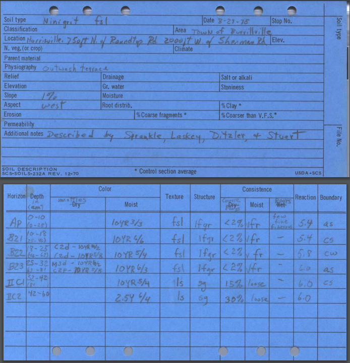
<small>_Source_: http://nesoil.com/ri/oldpedons/Ninigret_historic.pdf</small>
]

??? Soil descriptions as emulators of natural variation

Routine soil descriptions are aggregated to create soil survey products. 

 - In the past the individual points and source data were not considered the "product," yet there are increasing requests related to these data from soil survey users 
 
 - In update work, we are confronted with "changes" in soil properties due to level of detail in descriptions, new lab data, layers, taxonomic units and more. 

  - Are these "changes" meaningful in context of "similar soils"?
  - How can we systematically evaluate the similarity of soil concepts with different depth support?
  - How can we maximize value from historic data that may be cost-prohibitive to replicate?
  - How can we get more information from _new_ descriptions?
  
---
class: bodySlideNOBR
<br>

## Lumpers v.s. Splitters

.pull-left[

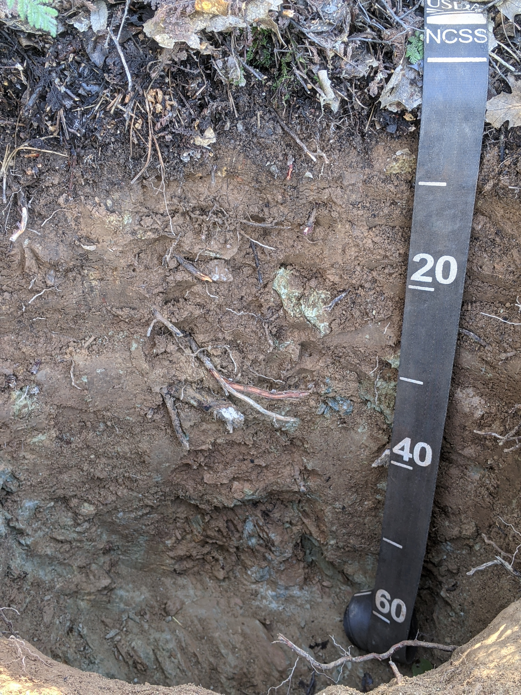

]

.pull-right[


]

---
class: bodySlideNOBR
<br>
## Lumpers v.s. Splitters
**Pedons** (source: FY2020 SQLite snapshots)
 - NASIS Pedon: 2,897,664 horizons in 573,919 NASIS pedons; ~5 layers each
 - KSSL/LDM: 410,011 horizons in 65,952 laboratory pedons; ~6 layers each
 
**Components** (source: Soil Data Access)
 - SSURGO: 3,474,612 horizons in 868,508 components; ~4 layers each
 - STATSGO: 333,388 horizons in 102,729 components; ~3 layers each
 
**GlobalSoilMap** 
 - 6 standard depth intervals:<br>
     0-5 cm, 5-15 cm, 15-30 cm, 30-60 cm, 60-100 cm and 100-200 cm
 - <small>https://www.isric.org/sites/default/files/GlobalSoilMap_specifications_december_2015_2.pdf</small>

---
class: bodySlide
<br>

## Trends in "horizonation" schemes

Average number of layers per component (per SSA), binned by decade (correlation year)

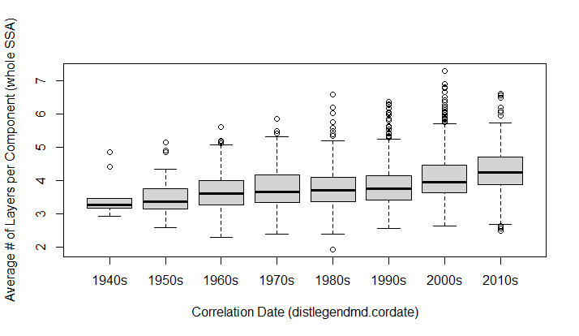

---
class: bodySlideNOBR
<br>

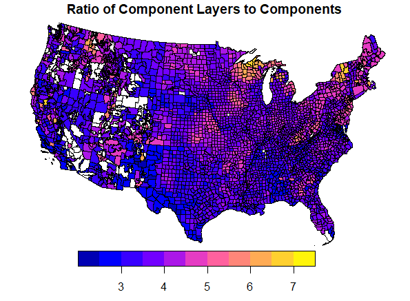

---
class: bodySlideLite
<br>

## Horizon Boundaries

.pull-left[
#### Distinctness
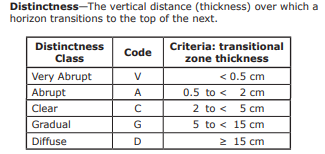

#### Topography
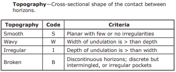
]

.pull-right[
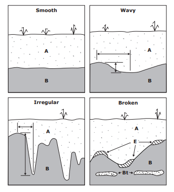
<small>_Source_: [Field Book for Describing and Sampling Soils](https://www.nrcs.usda.gov/wps/portal/nrcs/detail/soils/research/guide/?cid=nrcs142p2_054184)</small>
]

---
class: bodySlide
<br>

## Soil Profile Sketches and Simulation with {aqp} R package

.left-column[
  [](http://ncss-tech.github.io/aqp/)

  <br>

  [](https://www.r-project.org/)
]

.right-column[

The Algorithms for Quantitative Pedology (AQP) project is a suite of R packages for quantitative analysis of soil profile data. 
 - "aqp" package provides a vocabulary (functions and data structures)
 - "soilDB" package provides interfaces to databases and web services
 
AQP Website: http://ncss-tech.github.io/AQP/

aqp R package on GitHub: https://github.com/ncss-tech/aqp

SSSA 2020 Presentations: https://github.com/brownag/SSSA2020/
]

---
class: bodySlideNOBR
<br>

## OSD Profile Sketches
.center[
Using representative depths as boundaries
```{r, echo = FALSE}
# example profile
x <- soilDB::fetchOSD(c('boomer', 'bigridge', 'minniecreek', 'trabuco', 'auburn', 'jasperpeak', 'loafercreek', 'gardellones'))

# convert horizon distinctness codes into reasonable depth offsets
x$hd <- aqp::hzDistinctnessCodeToOffset(
  x$distinctness, 
  codes = c('very abrupt', 'abrupt', 'clear', 'gradual', 'diffuse')
)

# sketch using horizon boundary encoded
par(mar = c(0, 0, 0, 0))
aqp::plotSPC(
  x,
  width = 0.3,
  name.style = 'center-center',
  plot.depth.axis = FALSE,
  hz.depths = TRUE
)
```
]

---
class: bodySlideNOBR
<br>

## OSD Profile Sketches + distinctness
.center[
Using `aqp::hzDistinctnessCodeOffset()`
```{r, echo = FALSE}
# example profile
x <- soilDB::fetchOSD(c('boomer', 'bigridge', 'minniecreek', 'trabuco', 'auburn', 'jasperpeak', 'loafercreek', 'gardellones'))

# convert horizon distinctness codes into reasonable depth offsets
x$hd <- aqp::hzDistinctnessCodeToOffset(
  x$distinctness, 
  codes = c('very abrupt', 'abrupt', 'clear', 'gradual', 'diffuse')
)

# sketch using horizon boundary encoded
par(mar = c(0, 0, 0, 0))
aqp::horizons(x)$boundlty <-  2
aqp::plotSPC(
  x,
  width = 0.3,
  hz.distinctness.offset = 'hd',
  hz.boundary.lty = "boundlty",
  name.style = 'center-center',
  plot.depth.axis = FALSE,
  hz.depths = TRUE
)

```
]

---
class: bodySlideNOBR
<br>

## Generalization of Horizons

.center[
Using regular expressions to group similar horizons with `aqp::generalize.hz()`
```{r, echo=FALSE}
# example profile
x <- soilDB::fetchOSD(c('boomer', 'bigridge', 'minniecreek', 'trabuco', 
                        'auburn', 'jasperpeak', 'loafercreek', 'gardellones'))

# convert horizon distinctness codes into reasonable depth offsets
x$hd <- aqp::hzDistinctnessCodeToOffset(
  x$distinctness, 
  codes = c('very abrupt', 'abrupt', 'clear', 'gradual', 'diffuse')
)
x$genhz <- aqp::generalize.hz(
  x$hzname,
  new = c(
    'Oi',
    'A',
    'BA',
    'Bt',
    'Bw',
    'Btqm',
    'Btg',
    'Bss',
    'BC',
    'BCg',
    'C',
    'Cr'
  ),
  pat = c(
    'O',
    '^[2-9]?[AE]B?C?p?d?t?[1-9]?$',
    '^[2-9]?BA?E?t?[1-9]?$',
    '^[2-9]?B[1-9]?tb?[1-9]?$',
    '^[2-9]?Bw[1-9]?$',
    '^[2-9]?Btqc?m?[1-9]?$',
    '^[2-9]?Bt?g[1-9]?$',
    '^[2-9]?B.*ss.*[1-9]?$',
    '^[2-9]?BCt?c?[1-9]?$',
    '^[2-9]?BCt?c?g[1-9]?$',
    '^[2-9]?C[^r]?t?[1-9]?$',
    '^[2-9]?(C[dr]t?|Rt?)[1-9]?'
  )
)

# sketch using horizon boundary encoded
par(mar = c(0, 0, 0, 0))
aqp::horizons(x)$boundlty <- 2
aqp::plotSPC(
  x,
  width = 0.3,
  color = 'genhz',
  hz.distinctness.offset = 'hd',
  hz.boundary.lty = "boundlty",
  name.style = 'center-center',
  plot.depth.axis = FALSE,
  hz.depths = TRUE
)
```
]

---
class: bodySlideNOBR
<br>

## Horizon Boundary Sketches

<small>_Source_: https://ncss-tech.github.io/AQP/aqp/hz-boundaries.html</small>
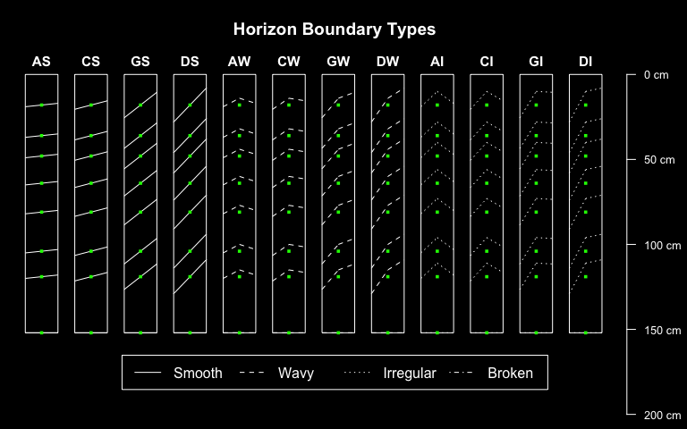

---
class: bodySlideNOBR
<br>

## Perturbation-based Methods

.pull-left[
 - [`aqp::perturb()`](http://ncss-tech.github.io/aqp/docs/reference/perturb.html) "Perturbs" the _boundary thickness between horizons_ or the _thickness of horizons_ using a standard deviation specified as a horizon-level attribute. 
]

.pull-right[
By the empirical rule:
 - 68% of the boundary/horizon thicknesses within 1 standard deviation of source
 - 95% within 2 standard deviations
 - 99.7% within 3 standard deviations
]

Distributional assumption applies only to the _geometry_. Not horizon or aggregate "site level" properties. 

 - Documentation: http://ncss-tech.github.io/aqp/docs/reference/perturb.html
 
 - Demo: https://ncss-tech.github.io/AQP/aqp/perturb.html
 
---
class: bodySlideNOBR
<br>

.center[

#### "Normal" Boundaries

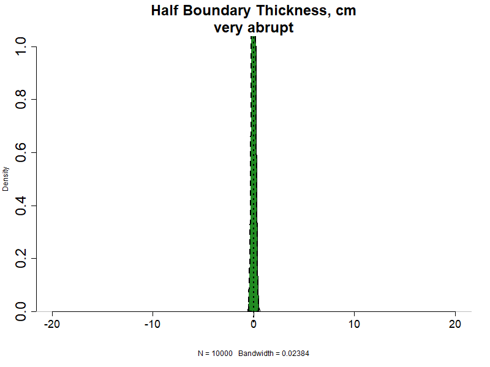

]

---
class: bodySlideNOBR
<br>
.center[

#### Minniecreek Generalized Horizons

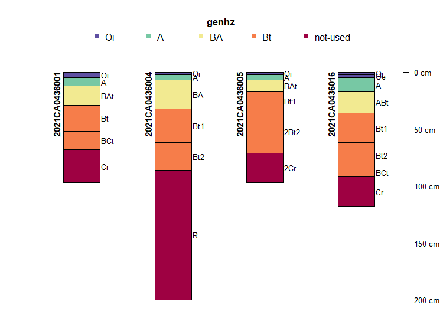

]

---
class: bodySlideNOBR
<br>
#### Thickness of Generalized Horizons
n=100 realizations for each of 4 profiles 
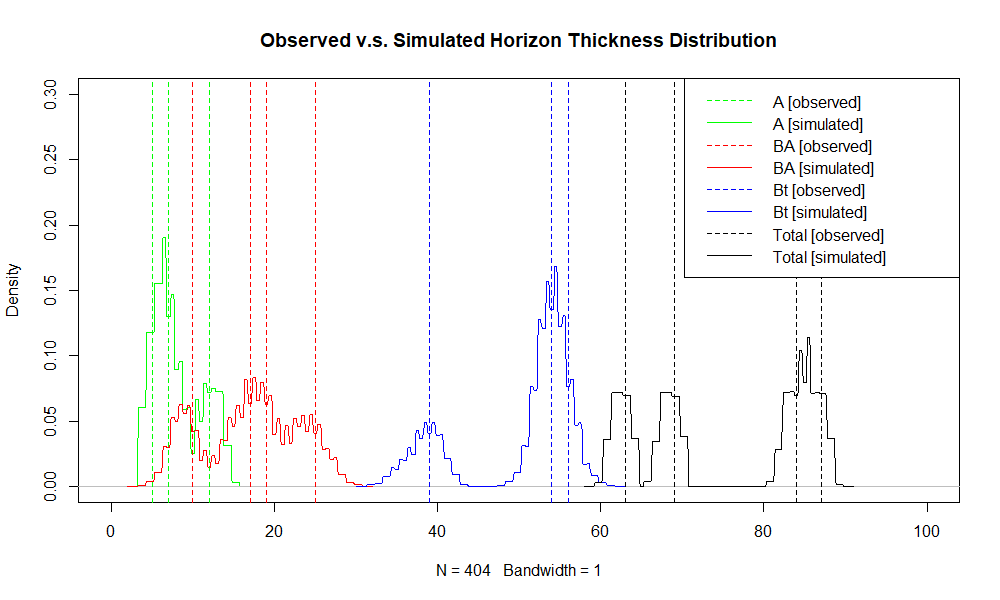

---
class: bodySlideNOBR
<br>

#### Example: Organic Carbon Stocks
n=10,000 aggregate carbon stocks; constant 2.5cm standard deviation  
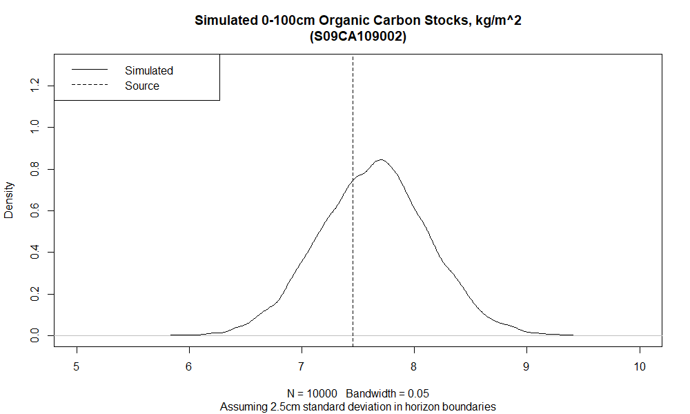

---
class: bodySlideNOBR
<br>

#### Example: Organic Carbon Stocks

n=10,000 aggregate carbon stocks using field horizon boundary distinctness
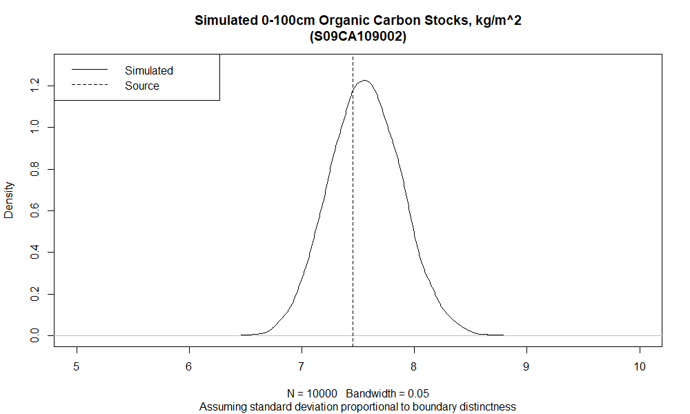

---
class: bodySlide
<br>

## "Problems"

### "Narrow" or disturbed observation methods (probe, bucket auger)

### Irregular and Broken Topography

### Total Soil Depth 

### Integrating results from multiple pedons -> component and series decisions

<!-- ???  -->
<!-- https://www.sciencedirect.com/science/article/pii/S0016706118312485 -->

---
class: bodySlide
<br>

## Thank you!

Feel free to contact me with comments/questions/criticism. 

Presentation and related materials on GitHub: https://github.com/brownag/FieldNotes202108

We also welcome you to take part in discussions related to {aqp} algorithms and {soilDB} data access methods on the GitHub issues pages:

 - https://github.com/ncss-tech/aqp/issues
 
 - https://github.com/ncss-tech/soilDB/issues

_USDA is an equal opportunity provider, employer, and lender._

.left-column[
  <br>
  
]

.right-column[
  #### Andrew G. Brown

<a href="mailto:andrew.g.brown@usda.gov">`r icons::fontawesome("mail-bulk")`&nbsp;andrew.g.brown@usda.gov</a><br>
<a href="http://github.com/brownag">`r icons::fontawesome("github")`&nbsp;brownag</a><br>

]
<br><br><br>
